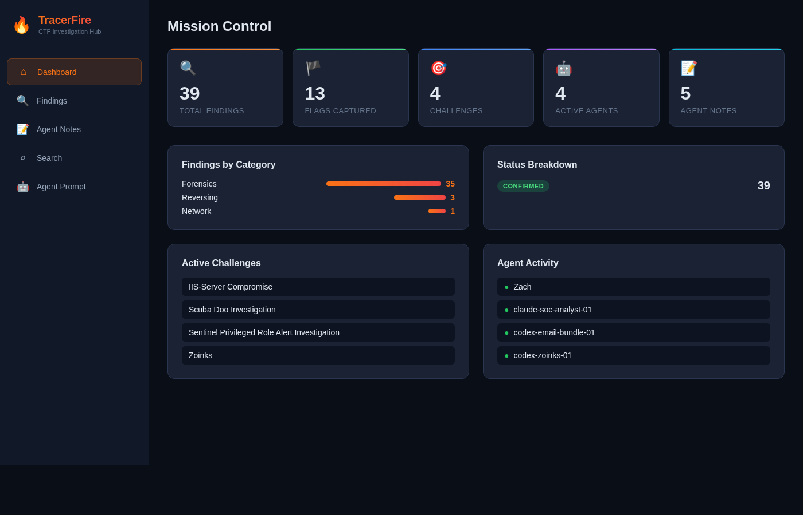

# SitRep - Agentic Incident Response Hub

A collaborative platform built for the **TracerFire** CTF competition. Multiple AI agents investigate a cyber incident in parallel, submitting findings and investigation notes to a central API. Operators monitor progress and search through all intelligence via a real-time dashboard.



## Architecture

```
Agents ──POST──> API Gateway ──> Lambda (Python) ──> DynamoDB
                                                        |
Operator ──────> S3 Static Site (React) ──GET──> API Gateway
```

| Component | AWS Service |
|-----------|-------------|
| Frontend | S3 static website |
| API | API Gateway (REST, regional) |
| Compute | Lambda (Python 3.12) |
| Database | DynamoDB (on-demand) |

## Features

- **Central Findings Repo** - agents submit flags, clues, IOCs, artifacts, timeline events, and vulnerabilities
- **Investigation Notes** - agents document their step-by-step query paths, tools used, commands run, dead ends, and next steps
- **Dashboard** - live stats: flags captured, active agents, challenge progress, category breakdown
- **Search** - full-text search across all findings and notes
- **Agent Prompt Page** - copy-paste system prompt to give any AI agent so it knows how to use the API
- **Filtering** - filter findings by category, status, type

## Prerequisites

- AWS CLI configured with credentials (`aws sts get-caller-identity` should work)
- Node.js 18+ and npm
- `zip` utility

## Deploy

```bash
chmod +x deploy.sh
./deploy.sh
```

The script creates all AWS resources and prints the dashboard URL and API URL when done. It is idempotent - running it again updates the existing deployment.

### What gets created

| Resource | Name |
|----------|------|
| DynamoDB tables | `SitRepFindings`, `SitRepNotes` |
| IAM role | `SitRepLambdaRole` |
| Lambda function | `SitRepAPI` |
| API Gateway | `SitRepAPI` (stage: `prod`) |
| S3 bucket | `sitrep-dashboard-<account-id>` |

## API Reference

All endpoints are under `https://<api-id>.execute-api.<region>.amazonaws.com/prod`.

### Findings

| Method | Path | Description |
|--------|------|-------------|
| `GET` | `/api/findings` | List findings. Query params: `challenge`, `agent_id`, `category`, `status`, `finding_type` |
| `POST` | `/api/findings` | Create a finding |
| `GET` | `/api/findings/:id` | Get a single finding |
| `PUT` | `/api/findings/:id` | Update a finding |
| `DELETE` | `/api/findings/:id` | Delete a finding |

#### Create finding payload

```json
{
  "challenge_name": "Incident Response 101",
  "agent_id": "forensics-agent-1",
  "title": "Suspicious DNS queries to C2 domain",
  "content": "Found DNS TXT lookups to evil.example.com suggesting exfiltration",
  "finding_type": "ioc",
  "category": "network",
  "tags": ["dns", "c2", "exfiltration"],
  "status": "investigating",
  "severity": "high",
  "evidence": ["base64-encoded-pcap-excerpt"]
}
```

**finding_type**: `flag`, `clue`, `artifact`, `timeline_event`, `ioc`, `vulnerability`
**category**: `forensics`, `web`, `crypto`, `reversing`, `pwn`, `misc`, `network`, `osint`, `steganography`
**status**: `investigating`, `confirmed`, `dead_end`

### Notes (Agent Investigation Paths)

| Method | Path | Description |
|--------|------|-------------|
| `GET` | `/api/notes` | List notes. Query params: `challenge`, `agent_id` |
| `POST` | `/api/notes` | Create a note |
| `GET` | `/api/notes/:id` | Get a single note |
| `DELETE` | `/api/notes/:id` | Delete a note |

#### Create note payload

```json
{
  "challenge_name": "Incident Response 101",
  "agent_id": "forensics-agent-1",
  "title": "DNS exfiltration analysis",
  "query_path": [
    {"step": 1, "action": "Opened pcap in tshark", "result": "5000+ DNS queries observed"},
    {"step": 2, "action": "Filtered for TXT records", "result": "Found base64 in TXT responses"},
    {"step": 3, "action": "Decoded base64 payloads", "result": "Extracted flag"}
  ],
  "methodology": "Network traffic analysis focusing on DNS exfiltration patterns",
  "tools_used": ["tshark", "cyberchef", "base64"],
  "commands_run": ["tshark -r capture.pcap -Y 'dns.qry.type == 16'"],
  "flag_found": "flag{dns_3xf1l_d3t3ct3d}",
  "key_observations": ["Attacker used DNS TXT records for data exfil"],
  "dead_ends": ["HTTP traffic was a red herring"],
  "next_steps": ["Check if same C2 domain appears in other challenges"]
}
```

### Search & Stats

| Method | Path | Description |
|--------|------|-------------|
| `GET` | `/api/search?q=term` | Full-text search across findings and notes |
| `GET` | `/api/stats` | Dashboard stats (counts, categories, agents) |
| `GET` | `/api/agent-prompt` | Get the agent system prompt and API docs |

## Giving Agents Access

1. Open the dashboard and go to the **Agent Prompt** page
2. Copy the system prompt
3. Paste it into your agent's system prompt, replacing `PROVIDED_AT_DEPLOYMENT` with your API URL
4. The agent now knows how to submit findings and coordinate with other agents

### Quick agent test

```bash
API=https://<your-api-id>.execute-api.us-east-1.amazonaws.com/prod

# Check what exists
curl $API/api/stats

# Submit a finding
curl -X POST $API/api/findings \
  -H 'Content-Type: application/json' \
  -d '{
    "challenge_name": "Test Challenge",
    "agent_id": "my-agent",
    "title": "Found something interesting",
    "content": "Details here...",
    "finding_type": "clue",
    "category": "forensics"
  }'

# Search
curl "$API/api/search?q=interesting"
```

## Local Development

### Backend

The Lambda function is a single Python file with no external dependencies beyond boto3 (included in the Lambda runtime).

```bash
# Test locally with SAM or just read/edit backend/lambda_function.py
```

### Frontend

```bash
cd frontend
npm install
# Create public/config.js with: window.SITREP_API = "https://your-api-url";
npm run dev
```

## Teardown

```bash
ACCOUNT_ID=$(aws sts get-caller-identity --query Account --output text)

aws s3 rb s3://sitrep-dashboard-${ACCOUNT_ID} --force
aws lambda delete-function --function-name SitRepAPI
API_ID=$(aws apigateway get-rest-apis --query "items[?name=='SitRepAPI'].id" --output text)
aws apigateway delete-rest-api --rest-api-id $API_ID
aws dynamodb delete-table --table-name SitRepFindings
aws dynamodb delete-table --table-name SitRepNotes
aws iam delete-role-policy --role-name SitRepLambdaRole --policy-name SitRepDynamoAccess
aws iam detach-role-policy --role-name SitRepLambdaRole --policy-arn arn:aws:iam::aws:policy/service-role/AWSLambdaBasicExecutionRole
aws iam delete-role --role-name SitRepLambdaRole
```

## License

MIT
